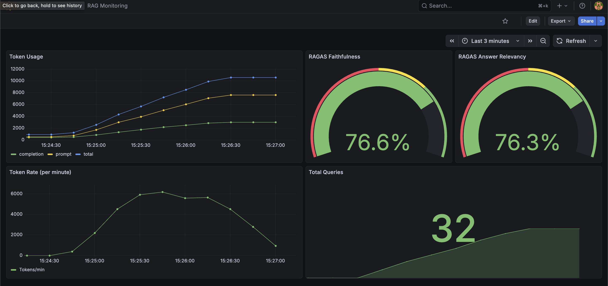

# AI Customer Support Agent Platform

[](https://www.python.org/downloads/)
[](https://fastapi.tiangolo.com)
[](https://github.com/psf/black)
[](https://www.docker.com/)
[](https://github.com/moseskim1027/ai-support-agent-platform/actions/workflows/ci.yml)
[](https://opensource.org/licenses/MIT)

A production-ready, multi-agent customer support platform demonstrating advanced AI agent orchestration, RAG pipelines, and real-time conversational interfaces.

## Architecture

### System Overview

```
┌─────────────────────────────────────────────────────────────────────┐
│                           Client Layer                              │
│  ┌──────────────────────────────────────────────────────────────┐   │
│  │  React Frontend (Vite + TypeScript)                          │   │
│  │  - Chat Interface                                            │   │
│  │  - Real-time messaging                                       │   │
│  │  - Agent status indicators                                   │   │
│  └──────────────────────────────────────────────────────────────┘   │
└────────────────────────────────┬────────────────────────────────────┘
                                 │ HTTP/REST
┌────────────────────────────────▼────────────────────────────────────┐
│                         API Gateway Layer                           │
│  ┌─────────────────────────────────────────────────────────────┐    │
│  │  FastAPI Backend                                            │    │
│  │  - REST API endpoints                                       │    │
│  │  - Request validation (Pydantic)                            │    │
│  │  - CORS & security headers                                  │    │
│  └─────────────────────────────────────────────────────────────┘    │
└────────────────────────────────┬────────────────────────────────────┘
                                 │
┌────────────────────────────────▼─────────────────────────────────────┐
│                    Agent Orchestration Layer                         │
│  ┌───────────────────────────────────────────────────────────────┐   │
│  │  LangGraph Workflow                                           │   │
│  │  ┌──────────┐  ┌──────────┐  ┌──────────┐  ┌──────────┐       │   │
│  │  │  Router  │─▶│   RAG    │  │   Tool   │  │ Responder│       │   │
│  │  │  Agent   │  │  Agent   │  │  Agent   │  │  Agent   │       │   │
│  │  └──────────┘  └──────────┘  └──────────┘  └──────────┘       │   │
│  │       │              │              │              │          │   │
│  │       └──────────────┴──────────────┴──────────────┘          │   │
│  └───────────────────────────────────────────────────────────────┘   │
└────────────────────────────────┬─────────────────────────────────────┘
                                 │
┌────────────────────────────────▼────────────────────────────────────┐
│                         Data & Services Layer                       │
│  ┌─────────────┐  ┌─────────────┐  ┌─────────────┐  ┌──────────┐    │
│  │   Qdrant    │  │  PostgreSQL │  │    Redis    │  │  OpenAI  │    │
│  │  (Vectors)  │  │    (Data)   │  │   (Cache)   │  │   API    │    │
│  └─────────────┘  └─────────────┘  └─────────────┘  └──────────┘    │
└─────────────────────────────────────────────────────────────────────┘
```

### Agent Orchestration Flow

```
User Message
     │
     ▼
┌─────────────────┐
│  Router Agent   │  ◄── Classifies intent using LLM
│  (GPT-4o-mini)  │      - knowledge: Information retrieval
└────────┬────────┘      - action: Tool execution
         │               - conversation: General chat
         │
    ┌────┴────┬──────────────┐
    ▼         ▼              ▼
┌────────┐ ┌─────────┐ ┌──────────────┐
│  RAG   │ │  Tool   │ │  Responder   │
│ Agent  │ │ Agent   │ │    Agent     │
└───┬────┘ └────┬────┘ └──────┬───────┘
    │           │             │
    │           │             │
    ▼           ▼             ▼
┌────────┐ ┌─────────┐ ┌──────────────┐
│ Qdrant │ │ Sample  │ │     LLM      │
│ Search │ │ Tools   │ │   Response   │
└───┬────┘ └────┬────┘ └──────┬───────┘
    │           │             │
    └───────────┴─────────────┘
                 │
                 ▼
         Final Response
```

### API Design

#### Chat Endpoint

```
POST /api/chat
Content-Type: application/json

Request:
{
  "message": "What is your return policy?",
  "conversation_id": "optional-uuid",
  "history": [
    {"role": "user", "content": "previous message"},
    {"role": "assistant", "content": "previous response"}
  ]
}

Response:
{
  "message": "Our return policy allows returns within 30 days...",
  "conversation_id": "uuid-1234",
  "agent_type": "rag",
  "intent": "knowledge",
  "sources": ["doc1", "doc2"],
  "metadata": {
    "timestamp": "2024-01-10T12:00:00Z",
    "tool_calls": 0,
    "docs_retrieved": 3
  }
}
```

#### Health Check

```
GET /api/health

Response:
{
  "status": "healthy",
  "timestamp": "2024-01-10T12:00:00Z",
  "version": "0.2.0"
}
```

## Features

- **Multi-Agent Orchestration**: Router, RAG, Tool, and Supervisor agents using LangGraph
- **Advanced RAG Pipeline**: Hybrid search combining dense (vector) and sparse (BM25) retrieval with Reciprocal Rank Fusion
- **Real-time Chat**: FastAPI REST API and WebSocket support for streaming responses
- **Conversation Persistence**: PostgreSQL-backed conversation history with full CRUD operations
- **Authentication & Security**: JWT-based authentication with user registration and login
- **Rate Limiting**: Intelligent rate limiting per user/IP with Redis-backed storage
- **Observability**: Prometheus metrics and Grafana dashboards
- **Production-Ready**: Docker containerization, health checks, database migrations, and CI/CD

## Feature Details

### Conversation History Persistence

All conversations are automatically persisted to PostgreSQL with:
- Automatic conversation creation and tracking
- Full message history storage with metadata
- Agent type, intent, and sources tracking per message
- Conversation retrieval API for loading past conversations
- Database migrations with Alembic for schema management

### Advanced RAG with Hybrid Search

The RAG system now uses hybrid search combining:
- **Dense Search**: Semantic similarity using OpenAI embeddings (1536-dimensional vectors)
- **Sparse Search**: Keyword matching using BM25 algorithm
- **Reciprocal Rank Fusion (RRF)**: Intelligent fusion of results from both methods
- Configurable weights and fallback strategies for optimal retrieval

### WebSocket Streaming

Real-time streaming chat via WebSocket:
- Bi-directional communication for live updates
- Chunked response streaming for better UX
- Connection management with auto-reconnect
- Status updates (processing, complete, error)
- Conversation persistence integrated

### JWT Authentication

Production-ready authentication system:
- User registration with email validation
- Secure password hashing with bcrypt
- JWT token-based authentication
- Protected routes with user context
- User profile endpoints

### Rate Limiting

Intelligent request throttling:
- Per-user rate limiting (when authenticated)
- Per-IP rate limiting (for anonymous requests)
- Redis-backed distributed rate limiting
- Configurable limits per environment
- Graceful error responses with retry headers

### Monitoring and Observability

Comprehensive monitoring with Prometheus metrics and Grafana dashboards to track RAG pipeline performance and quality:




**Key Metrics Tracked:**

1. **Token Usage**
   - Prompt tokens: Input context size
   - Completion tokens: Generated response size
   - Total tokens: Combined usage for cost tracking

2. **RAGAS Quality Scores**
   - **Faithfulness** (76.6%): Measures factual accuracy of answers against retrieved context
   - **Answer Relevancy** (76.3%): Measures how well answers address the user's question
   - **Context Precision**: Evaluates relevance of retrieved documents
   - **Context Recall**: Measures completeness of retrieved context

3. **Performance Metrics**
   - Request latency (retrieval, generation, evaluation, total)
   - Token generation rate (tokens/minute)
   - Query throughput (requests/minute)
   - Success/failure rates by agent type

4. **System Health**
   - Total queries processed
   - Error rates by type
   - Agent routing distribution

**Accessing Dashboards:**

```bash
# Start monitoring stack
docker-compose up -d prometheus grafana

# Access dashboards
# Grafana: http://localhost:3001 (admin/admin)
# Prometheus: http://localhost:9090
```

**Setting Up the RAG Monitoring Dashboard:**

1. **Access Grafana**: Navigate to http://localhost:3001 and login with `admin/admin`

2. **Add Prometheus Data Source** (if not already configured):
   - Go to **Configuration** → **Data Sources**
   - Click **Add data source** → Select **Prometheus**
   - Set URL to `http://prometheus:9090`
   - Click **Save & Test**

3. **Import the Dashboard**:
   - Click the **+** icon in the left sidebar → **Import**
   - Click **Upload JSON file**
   - Select `infrastructure/grafana/dashboards/rag-monitoring.json`
   - Select the Prometheus data source
   - Click **Import**

The dashboard will now display real-time metrics for token usage, RAGAS quality scores, query rates, and system health.

**Generating Test Metrics:**

```bash
# Generate sample metrics for dashboard visualization
curl 'http://localhost:8000/api/test/simulate-metrics-sync?num_queries=30'
```

The monitoring system automatically tracks all RAG queries in real-time, providing visibility into both performance and quality metrics. RAGAS evaluation runs asynchronously to avoid adding latency to user requests.

## Tech Stack

### Frontend
- **React 18** - Modern UI library
- **TypeScript** - Type-safe development
- **Vite** - Fast build tool and dev server
- **Axios** - HTTP client

### Backend
- **FastAPI** - High-performance async API framework
- **LangGraph** - Multi-agent workflow orchestration
- **LangChain** - LLM framework and integrations
- **Qdrant** - Vector database for RAG
- **PostgreSQL** - Relational data storage
- **Redis** - Caching and session management
- **Prometheus + Grafana** - Metrics and monitoring

### Infrastructure
- **Docker & Docker Compose** - Containerization
- **Nginx** - Frontend web server and reverse proxy
- **Kubernetes** - Container orchestration (EKS ready)
- **GitHub Actions** - CI/CD pipeline

## Quick Start

### Prerequisites
- **Docker & Docker Compose** (recommended for full stack)
- **Python 3.11+** (for backend local development)
- **Node.js 20+** and **Yarn** (for frontend local development)

### Option 1: Docker Compose (Recommended)

**Complete stack with one command:**

```bash
# 1. Clone repository
git clone git@github-secondary:moseskim1027/ai-support-agent-platform.git
cd ai-support-agent-platform

# 2. Setup environment
cp .env.example .env

# 3. Edit .env and add your OpenAI API key
#    OPENAI_API_KEY=sk-your-key-here

# 4. Start all services (frontend + backend + databases)
docker-compose up -d

# Note: Database migrations run automatically on backend startup

# 5. View logs
docker-compose logs -f frontend backend
```

**Access the application:**
- **Frontend**: http://localhost:3000
- **Backend API**: http://localhost:8000
- **API Documentation**: http://localhost:8000/api/docs
- **Grafana**: http://localhost:3001 (admin/admin)
- **Prometheus**: http://localhost:9090

### Option 2: Local Development

**Backend Only:**

```bash
# 1. Navigate to backend
cd backend

# 2. Create virtual environment
python -m venv venv
source venv/bin/activate  # Windows: venv\Scripts\activate

# 3. Install dependencies
pip install -r requirements.txt

# 4. Setup environment
cp .env.example .env
# Edit .env and add your OPENAI_API_KEY

# 5. Start services (requires Docker for databases)
docker-compose up -d postgres redis qdrant

# 6. Run database migrations
alembic upgrade head

# 7. Run backend server
uvicorn app.main:app --reload --host 0.0.0.0 --port 8000
```

Backend will be available at http://localhost:8000

**Database Migrations:**
```bash
# Create a new migration after model changes
alembic revision --autogenerate -m "description of changes"

# Apply migrations
alembic upgrade head

# Rollback one migration
alembic downgrade -1
```

**Frontend Only:**

```bash
# 1. Navigate to frontend
cd frontend

# 2. Install dependencies
yarn install
# or: npm install

# 3. Setup environment
cp .env.example .env
# VITE_API_URL should point to your backend (default: http://localhost:8000)

# 4. Start development server
yarn dev
# or: npm run dev
```

Frontend will be available at http://localhost:3000 with hot reload

**Full Local Development (Backend + Frontend):**

```bash
# Terminal 1 - Start databases
docker-compose up -d postgres redis qdrant prometheus grafana

# Terminal 2 - Start backend
cd backend
source venv/bin/activate
uvicorn app.main:app --reload --port 8000

# Terminal 3 - Start frontend
cd frontend
yarn dev
```

### Database Setup

The application uses PostgreSQL with Alembic for migrations:

```bash
# Run migrations (if using Docker Compose, this happens automatically)
cd backend
alembic upgrade head

# Create a new migration (after model changes)
alembic revision --autogenerate -m "description"

# Rollback last migration
alembic downgrade -1
```

Current migrations:
- `001`: Initial conversation tables (conversations, conversation_messages)
- `002`: User authentication tables (users)

### Testing the Application

**Web Interface:**
1. Open http://localhost:3000 in your browser
2. Click on sample prompts or type your own message
3. Observe different agents handling your requests:
   - **Knowledge questions** → RAG Agent (retrieves from Qdrant)
   - **Action requests** → Tool Agent (executes functions)
   - **General chat** → Responder Agent (conversational)

**API Testing:**

```bash
# Health check
curl http://localhost:8000/api/health

# Register a new user
curl -X POST http://localhost:8000/api/auth/register \
  -H "Content-Type: application/json" \
  -d '{
    "email": "user@example.com",
    "username": "testuser",
    "password": "securepassword123",
    "full_name": "Test User"
  }'

# Login (returns JWT token)
curl -X POST http://localhost:8000/api/auth/login \
  -H "Content-Type: application/json" \
  -d '{
    "email": "user@example.com",
    "password": "securepassword123"
  }'

# Chat with knowledge question (RAG agent with hybrid search)
curl -X POST http://localhost:8000/api/chat \
  -H "Content-Type: application/json" \
  -d '{"message": "What is your return policy?"}'

# Continue conversation (use conversation_id from previous response)
curl -X POST http://localhost:8000/api/chat \
  -H "Content-Type: application/json" \
  -d '{
    "message": "How long does it take?",
    "conversation_id": "your-conversation-id-here"
  }'

# Get conversation history
curl http://localhost:8000/api/conversations/{conversation_id}

# Chat with authentication (for personalized features)
curl -X POST http://localhost:8000/api/chat \
  -H "Content-Type: application/json" \
  -H "Authorization: Bearer YOUR_JWT_TOKEN" \
  -d '{"message": "Hello!"}'

# Get current user info
curl http://localhost:8000/api/auth/me \
  -H "Authorization: Bearer YOUR_JWT_TOKEN"
```

**WebSocket Testing:**

```javascript
// Connect to WebSocket
const ws = new WebSocket('ws://localhost:8000/api/ws/chat');

// Listen for messages
ws.onmessage = (event) => {
  const data = JSON.parse(event.data);
  console.log('Received:', data);
};

// Send a message
ws.send(JSON.stringify({
  type: 'message',
  message: 'What is your return policy?',
  conversation_id: 'optional-conversation-id'
}));

// Ping to keep connection alive
ws.send(JSON.stringify({ type: 'ping' }));
```

## Development

### Frontend Development

```bash
# Navigate to frontend directory
cd frontend

# Install dependencies
yarn install
# or: npm install

# Start development server (with hot reload)
yarn dev
# or: npm run dev

# Build for production
yarn build
# or: npm run build

# Preview production build
yarn preview
# or: npm run preview

# Lint code
yarn lint
# or: npm run lint

# Format code
yarn format
# or: npm run format
```

**Frontend Structure:**
```
frontend/
├── src/
│   ├── components/       # React components
│   │   ├── ChatInterface.tsx
│   │   ├── MessageList.tsx
│   │   ├── ChatInput.tsx
│   │   ├── Header.tsx
│   │   └── WelcomeScreen.tsx
│   ├── services/         # API integration
│   │   └── api.ts
│   ├── types/            # TypeScript types
│   │   └── index.ts
│   ├── styles/           # CSS styles
│   │   └── App.css
│   ├── App.tsx          # Main app component
│   └── main.tsx         # Entry point
├── Dockerfile           # Production build
├── Dockerfile.dev       # Development build
├── nginx.conf           # Nginx configuration
└── vite.config.ts       # Vite configuration
```

### Backend Development

```bash
# Navigate to backend directory
cd backend

# Create virtual environment
python -m venv venv
source venv/bin/activate  # or `venv\Scripts\activate` on Windows

# Install dependencies
pip install -r requirements.txt

# Run development server
uvicorn app.main:app --reload --host 0.0.0.0 --port 8000
```

### Run Tests

**Unit and Integration Tests:**

```bash
# Run all tests (excluding E2E)
make test

# Run with coverage
make test-cov

# Run specific test file
pytest backend/tests/test_api.py -v
```

**End-to-End (E2E) Tests:**

E2E tests use real OpenAI API and Qdrant services. They are marked with `@pytest.mark.e2e` and automatically skipped in CI/CD.

```bash
# Prerequisites: Ensure services are running and .env has valid OPENAI_API_KEY
docker-compose up -d

# Run E2E tests locally
cd backend
pytest tests/test_e2e.py -v -m e2e

# Run all tests EXCEPT E2E (for CI/CD)
pytest tests/ -v -m "not e2e"
```

**E2E Test Coverage:**
- RAG functionality with real document retrieval
- Multi-turn conversation flows with context
- Edge cases (empty messages, special characters)
- Qdrant integration and retrieval accuracy
- Agent routing (RAG, Tool, Responder)

### View Logs

```bash
# All services
make logs

# Backend only
make logs-backend
```

### Local Development (without Docker)

```bash
cd backend

# Create virtual environment
python -m venv venv
source venv/bin/activate  # On Windows: venv\Scripts\activate

# Install dependencies
pip install -r requirements.txt

# Run server
python -m app.main
```

## Project Structure

```
ai-support-agent-platform/
├── frontend/
│   ├── src/
│   │   ├── components/      # React UI components
│   │   ├── services/        # API integration
│   │   ├── types/           # TypeScript types
│   │   └── styles/          # CSS styles
│   ├── Dockerfile           # Production build
│   ├── Dockerfile.dev       # Development build
│   └── package.json
├── backend/
│   ├── app/
│   │   ├── agents/          # Agent implementations
│   │   │   ├── base.py      # Base agent class
│   │   │   ├── router.py    # Intent classification
│   │   │   ├── rag.py       # RAG with hybrid search
│   │   │   ├── tool.py      # Function calling
│   │   │   ├── responder.py # Conversation handling
│   │   │   └── state.py     # State management
│   │   ├── orchestration/   # LangGraph workflows
│   │   │   └── workflow.py  # Multi-agent orchestration
│   │   ├── tools/           # Function calling tools
│   │   │   ├── registry.py  # Tool registry
│   │   │   └── sample_tools.py  # Sample implementations
│   │   ├── api/             # FastAPI routes
│   │   │   ├── chat.py      # Chat REST endpoint
│   │   │   ├── websocket.py # WebSocket streaming
│   │   │   ├── auth.py      # Authentication endpoints
│   │   │   └── health.py    # Health checks
│   │   ├── auth/            # Authentication & authorization
│   │   │   ├── utils.py     # JWT and password utilities
│   │   │   └── dependencies.py  # Auth dependencies
│   │   ├── database/        # Database layer
│   │   │   ├── models.py    # SQLAlchemy models
│   │   │   ├── session.py   # Database session
│   │   │   └── repositories.py  # Data access layer
│   │   ├── middleware/      # Middleware
│   │   │   └── rate_limit.py    # Rate limiting
│   │   ├── observability/   # Metrics and monitoring
│   │   ├── rag/             # RAG components
│   │   │   └── hybrid_retriever.py  # Hybrid search (dense + sparse)
│   │   ├── config.py        # Application configuration
│   │   └── main.py          # FastAPI application
│   ├── alembic/             # Database migrations
│   │   ├── versions/        # Migration files
│   │   └── env.py           # Alembic environment
│   ├── tests/               # Test suite
│   │   ├── conftest.py      # Test fixtures
│   │   ├── test_agents.py   # Agent unit tests
│   │   ├── test_api.py      # API endpoint tests
│   │   ├── test_orchestration.py  # Workflow tests
│   │   ├── test_rag.py      # RAG pipeline tests
│   │   ├── test_health.py   # Health check tests
│   │   └── test_e2e.py      # E2E tests (requires real services)
│   ├── Dockerfile
│   ├── pyproject.toml       # Test configuration
│   └── requirements.txt
├── infrastructure/
│   ├── prometheus.yml       # Prometheus config
│   └── k8s/                 # Kubernetes manifests
│       ├── base/            # Base resources
│       └── overlays/        # Environment-specific configs
├── .github/
│   └── workflows/           # CI/CD pipelines
│       ├── ci.yml           # Continuous Integration
│       ├── cd-staging.yml   # Deploy to staging
│       ├── cd-production.yml  # Deploy to production
│       └── pr-checks.yml    # Pull request checks
├── docker-compose.yml
├── Makefile
└── README.md
```

## API Endpoints

### Health Checks
- `GET /api/health` - Service health status
- `GET /api/ready` - Readiness probe (K8s)
- `GET /api/live` - Liveness probe (K8s)

### Authentication
- `POST /api/auth/register` - Register new user
- `POST /api/auth/login` - Login and get JWT token
- `GET /api/auth/me` - Get current user info (requires auth)

### Chat
- `POST /api/chat` - Send message to agent (REST, with rate limiting)
- `WS /api/ws/chat` - WebSocket endpoint for streaming chat
- `GET /api/conversations/{id}` - Get conversation history with all messages

### Metrics
- `GET /metrics` - Prometheus metrics

## Deployment

### GitFlow Workflow

This project follows a production-ready GitFlow strategy:

```
develop → staging → main
```

- **develop**: Feature integration and development
- **staging**: Pre-production testing environment
- **main**: Production environment

### CI/CD Pipelines

#### Continuous Integration (CI)
Runs on: Push or PR to `develop`, `staging`, `main`

**Checks:**
- Code formatting (black, isort)
- Linting (flake8)
- Type checking (mypy)
- Unit & integration tests (pytest)
- Security scanning (safety, bandit)
- Docker build verification

#### Continuous Deployment - Staging
Runs on: Push to `staging` branch

**Steps:**
1. Build Docker image with staging tag
2. Push to AWS ECR
3. Deploy to EKS staging cluster
4. Run integration test suite
5. Notify deployment status

#### Continuous Deployment - Production
Runs on: Push to `main` branch

**Steps:**
1. Build production Docker image
2. Push to AWS ECR with version tag
3. Deploy to EKS production cluster (rolling update)
4. Run smoke tests
5. Notify deployment status

### Kubernetes Deployment

Production deployment uses AWS EKS with the following resources:

- **Deployment**: Rolling updates, health checks, 3-10 replicas
- **Service**: ClusterIP for internal communication
- **Ingress**: AWS ALB with HTTPS support
- **HPA**: Auto-scaling based on CPU/memory
- **ConfigMap**: Environment-specific configuration
- **Secrets**: Managed via AWS Secrets Manager

See `infrastructure/k8s/` for complete Kubernetes manifests.

### Local Deployment Commands

```bash
# Start all services
make up

# View logs
make logs-backend

# Run tests
make test

# Check health
make health

# Stop all services
make down
```

### Production Deployment

```bash
# Deploy to staging (via Kustomize)
kubectl apply -k infrastructure/k8s/overlays/staging/

# Deploy to production
kubectl apply -k infrastructure/k8s/overlays/production/

# Monitor deployment
kubectl rollout status deployment/backend -n production

# View logs
kubectl logs -f deployment/backend -n production
```

## Roadmap

- [x] Project setup and Docker configuration
- [x] Basic FastAPI application with health endpoints
- [x] Production-ready environment configuration
- [x] CI/CD with GitHub Actions (linting, testing, deployment)
- [x] Kubernetes manifests for EKS deployment
- [x] Docker Compose for local development
- [x] Observability setup (Prometheus, Grafana)
- [x] Multi-agent orchestration with LangGraph
- [x] RAG pipeline with Qdrant vector database
- [x] Tool agent with function calling
- [x] Frontend React chat interface (TypeScript + Vite)
- [x] Comprehensive testing suite (23 tests, 63% coverage)
- [x] Conversation history persistence with PostgreSQL
- [x] Advanced RAG with hybrid search (dense + sparse/BM25)
- [x] WebSocket support for real-time streaming
- [x] User authentication and authorization (JWT)
- [x] Rate limiting and request throttling
- [x] RAGAS evaluation integration for RAG quality monitoring
- [x] Comprehensive metrics dashboard (Prometheus + Grafana)

## Contributing

This is a portfolio project. Feel free to fork and experiment!

## License

MIT